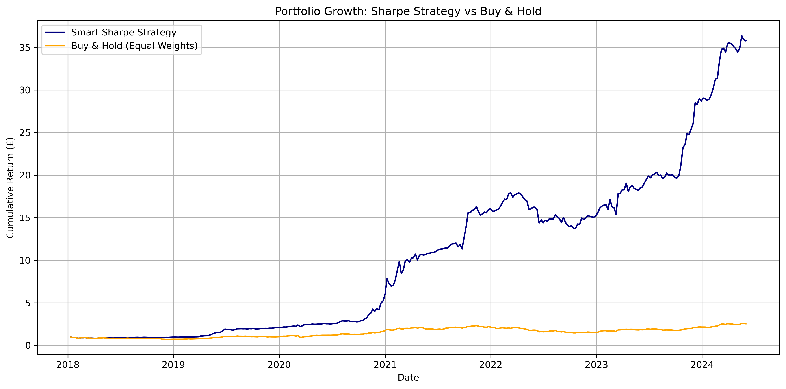

# Smart Portfolio Rebalancer 

This project explores a Sharpe-ratio-driven portfolio rebalancing strategy, using weekly historical data for SPY, TLT, GLD and BTC-USD. The goal was to create a simple yet effective method to dynamically allocate weights based on risk-adjusted returns — and to compare this against a traditional buy-and-hold portfolio.

---

## Why I Built This

I’ve always been fascinated by how data and logic can be applied to financial decision-making. With markets becoming more volatile and less predictable, I wanted to explore whether tactical allocation — driven by metrics like the Sharpe Ratio — could actually outperform the passive approach that dominates investing.

This project was a chance to apply my Python and data analysis skills to something real, and to better understand portfolio theory beyond the textbook definitions.

---

## The Strategy

- Pulls weekly price data (2018–2024) for four assets using `yfinance`
- Calculates weekly returns
- Ranks assets each week by their rolling Sharpe Ratio
- Allocates more weight to higher Sharpe assets dynamically
- Benchmarks the performance against a static 25/25/25/25 buy-and-hold strategy

---

## Key Results

| Strategy                    | CAGR     | Max Drawdown | Sharpe Ratio |
|-----------------------------|----------|---------------|---------------|
| Smart Sharpe Strategy       | 75.17%   | -23.41%       | 2.06          |
| Buy & Hold (Equal Weights)  | 15.66%   | -36.72%       | 0.81          |

📈 Performance chart:



---

## How to Run It

1. Clone the repo
2. Install the dependencies:
```bash
pip install -r requirements.txt
```
---

##What I Learned
Reinforced core portfolio concepts like drawdowns, CAGR, and Sharpe ratios

Improved confidence working with financial time series in Python

Learned how small strategic tweaks (like reweighting based on Sharpe) can lead to huge differences in outcome

Realised how important data sourcing and alignment is when working across asset classes

---

About Me
I'm currently studying Data Science at the University of Bristol, and I'm especially interested in quant trading, strategy, and consulting. This was a self-directed project I built to push my skills and create something I could actually be proud to share.

